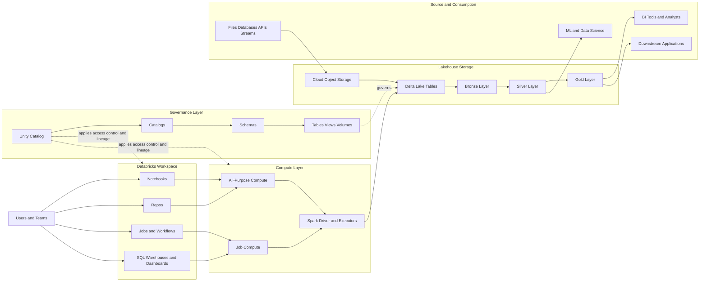

# 06 - Databricks Architecture Diagram

This page gives a single visual view of how the main Databricks concepts in this repo fit together.

## Diagram

## How to read it

- Users work inside the workspace through notebooks, repos, jobs, and SQL assets
- Compute executes Spark jobs and queries
- Data is usually stored in cloud object storage and managed as Delta Lake tables
- Unity Catalog governs access to catalogs, schemas, tables, and related data objects
- The medallion pattern organizes data progression from raw to curated outputs

## Key relationships

### Workspace vs compute

The workspace is the collaboration and asset-management surface. Compute is the execution engine.

### Delta Lake vs Unity Catalog

Delta Lake manages reliable tables on storage. Unity Catalog governs access, discovery, and lineage for those tables.

### Lakehouse flow

Data lands in storage, is processed by Spark on Databricks compute, stored as Delta tables, governed by Unity Catalog, and then consumed by analytics, ML, and applications.

## Practical explanation

For a typical daily pipeline:

1. Source data lands from files, APIs, or operational databases
2. A Databricks job runs on job compute
3. Spark reads raw data from cloud storage
4. The pipeline writes Bronze, Silver, and Gold Delta tables
5. Unity Catalog enforces who can access those objects
6. Analysts query Gold tables while data scientists use Silver and Gold layers

## Why this matters

This architecture is what allows Databricks to support data engineering, analytics, governance, and AI workflows inside one platform instead of stitching together separate systems.