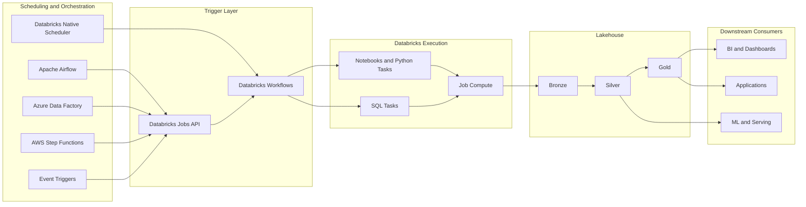

# 11 - Scheduler Architecture Diagram

This page shows how internal and external schedulers can work with Databricks.

## Diagram

## Interpretation

- Databricks native scheduling feeds directly into Databricks workflows
- External orchestrators usually trigger Databricks through the Jobs API
- Workflows run notebooks, Python tasks, and SQL tasks on Databricks compute
- Processed data flows into Bronze, Silver, and Gold layers
- Downstream BI, apps, and ML consumers read curated outputs

## Main takeaway

Internal scheduling is simplest when Databricks is the orchestration center.

External scheduling is usually the better choice when Databricks is only one part of a larger enterprise workflow.