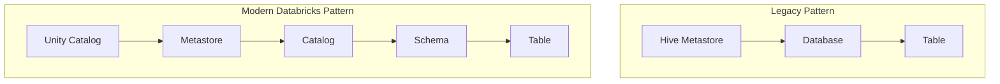

# 16 - Hive Metastore vs Catalog vs Unity Catalog

## Why people confuse these terms

These terms are related, but they refer to different layers of metadata organization and governance.

People often mix them up because all three are connected to how tables are stored, discovered, and accessed in Databricks.

The short version is:

- Hive metastore is an older metadata system
- a catalog is a namespace container
- Unity Catalog is the modern Databricks governance framework

## Short answer

| Term | What it is | Main purpose |
| --- | --- | --- |
| Hive metastore | Legacy metadata repository | Store database and table metadata |
| Catalog | Top-level namespace | Organize schemas and tables |
| Unity Catalog | Databricks governance system | Centralize access control, lineage, and discovery |

## The simplest distinction

- If you are talking about older table metadata and `database.table` style organization, you are usually talking about the Hive metastore world.
- If you are talking about a named container such as `main` or `finance`, you are talking about a catalog.
- If you are talking about centralized governance across workspaces, you are talking about Unity Catalog.

## What is Hive metastore

Hive metastore is a metadata service that stores information about databases, tables, schemas, partitions, and table locations.

Historically, many Spark and Hive environments used Hive metastore as the central place to register tables.

In older Databricks patterns, users often worked with tables like this:

`database.table`

Example:

`sales.orders`

In that model:

- the metastore stored metadata about the table
- permissions were often managed in a less centralized way
- governance and lineage were narrower than modern Unity Catalog capabilities

## What is a catalog

A catalog is a top-level namespace.

In Unity Catalog, the object hierarchy usually looks like this:

`metastore -> catalog -> schema -> table`

Example:

`main.sales.orders`

Here:

- `main` is the catalog
- `sales` is the schema
- `orders` is the table

A catalog is not the whole governance system. It is one container inside the governance model.

## What is Unity Catalog

Unity Catalog is Databricks' centralized governance layer for data and AI assets.

It provides:

- centralized permissions
- lineage
- auditing
- discovery
- shared governance across workspaces
- consistent organization of catalogs, schemas, tables, volumes, functions, and models

Unity Catalog does not replace the idea of a catalog. It governs catalogs and the objects inside them.

## Diagram

## Hive metastore vs Unity Catalog

| Topic | Hive metastore style | Unity Catalog |
| --- | --- | --- |
| Naming pattern | `database.table` | `catalog.schema.table` |
| Governance scope | Narrower and often workspace-local or legacy | Centralized across supported workspaces |
| Lineage | Limited compared to modern governance | Built-in governance and lineage features |
| Security model | Older, less unified patterns | Centralized grants and governance controls |
| Modern Databricks direction | Legacy pattern | Recommended governance model |

## Catalog vs Unity Catalog

This is the part that causes the most confusion.

### Catalog

A catalog is one namespace.

Examples:

- `main`
- `finance`
- `marketing`

### Unity Catalog

Unity Catalog is the full governance framework that manages many catalogs and the objects inside them.

Example:

- Unity Catalog governs `main.sales.orders`
- `main` is just one catalog inside Unity Catalog

## Example object names

### Older Hive metastore-style name

`sales.orders`

### Unity Catalog-style fully qualified name

`main.sales.orders`

That extra level is important.

It tells you the object is inside a catalog, not just a schema or database.

## When you still hear "Hive metastore"

You may still hear this term when:

- older Databricks workspaces are being migrated
- teams are using legacy table-registration patterns
- someone is describing Spark or Hive concepts rather than Unity Catalog concepts
- code or docs still refer to `database.table` instead of `catalog.schema.table`

## Practical migration understanding

When teams move from older patterns to Unity Catalog, the conceptual shift is usually:

1. Move from legacy metadata patterns to centralized governance
2. Move from `database.table` naming toward `catalog.schema.table`
3. Move from fragmented permissions to centralized grants and governance policies

## Practical rule of thumb

- Use "Hive metastore" when discussing legacy Spark or Hive metadata patterns.
- Use "catalog" when discussing the namespace level inside Unity Catalog.
- Use "Unity Catalog" when discussing modern Databricks governance.

## One-line summary

Hive metastore is the older metadata model, a catalog is one namespace container, and Unity Catalog is the modern Databricks governance system that manages those containers and their objects.