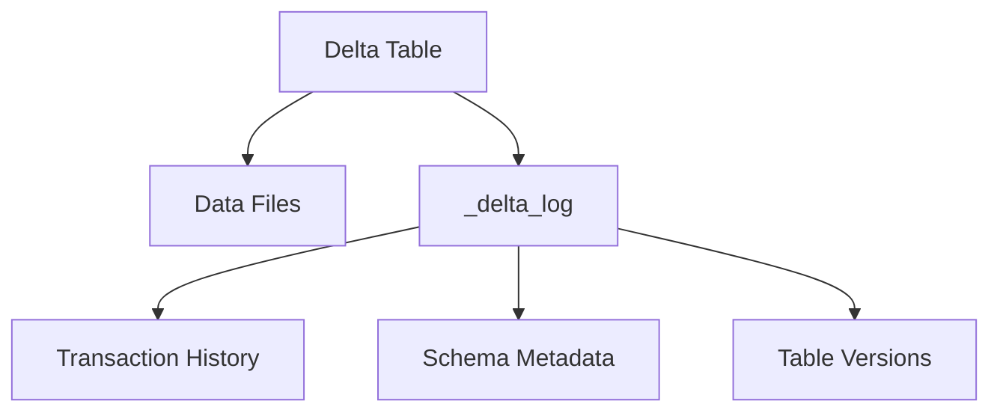
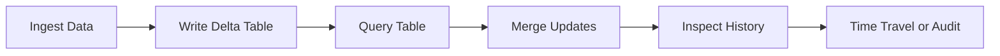

# 17 - What Is a Delta Table

## Short answer

A Delta table is a table stored in Delta Lake format.

In practice, that means the table is backed by data files plus a transaction log that tracks every committed change.

This is what allows the table to support features such as:

- ACID transactions
- schema enforcement
- schema evolution
- update, delete, and merge operations
- time travel
- table history

## Why this matters

Without Delta format, a table stored as plain files in object storage is harder to manage reliably.

You may still have data files, but you do not automatically get the same level of transactional behavior, auditability, or update support.

A Delta table gives you a more database-like experience on top of cloud object storage.

## What makes a Delta table different

A Delta table usually consists of:

- data files, often parquet files
- a `_delta_log` transaction log directory

The data files hold the actual rows.

The transaction log records what changed and in what order.

That log is what makes the table reliable for reads, writes, updates, and rollback-style inspection.

## Diagram



## Delta table vs plain parquet table

| Topic | Plain parquet files or table | Delta table |
| --- | --- | --- |
| Transactions | Limited | ACID transactions |
| Updates and deletes | Harder and less reliable | Supported directly |
| Merge support | Not native | Native Delta `MERGE` |
| Schema enforcement | Weaker | Stronger |
| Time travel | No | Yes |
| History tracking | Limited | Yes |

## How a Delta table is created

In Databricks, you can create a Delta table by writing data with format `delta`.

Example:

```python
data = [
    (1, "Asha", 1200.0),
    (2, "Miguel", 950.0)
]

df = spark.createDataFrame(data, ["customer_id", "customer_name", "spend"])

df.write.format("delta").mode("overwrite").saveAsTable("main.demo.customer_spend")
```

After this write, Databricks manages the table as a Delta table.

## What operations Delta tables support

Delta tables are especially useful because they support operations that come up constantly in real pipelines.

### Insert

Add new records.

### Update

Change existing rows.

### Delete

Remove rows conditionally.

### Merge

Upsert new and changed records into an existing table.

This is especially common for:

- CDC pipelines
- incremental ingestion
- slowly changing dimensions
- correction workflows

## Example table lifecycle



## Managed vs external Delta tables

Delta tables can be managed or external depending on how storage and metadata are defined.

### Managed Delta table

Databricks manages both the table metadata and the underlying storage location according to the workspace or catalog configuration.

### External Delta table

The table points to a storage location that is managed more explicitly by the user or platform team.

In both cases, the important point is that the table format is Delta.

## Why Delta tables are important in Databricks

Delta tables are the foundation for many common Databricks patterns:

- medallion architecture
- streaming pipelines writing to durable tables
- CDC and merge-based ingestion
- governed analytics tables under Unity Catalog
- reproducible debugging with history and time travel

## How to recognize a Delta table

You are usually dealing with a Delta table if:

- it is written with `.format("delta")`
- it supports `MERGE`, `UPDATE`, and `DELETE`
- it has table history and time-travel support
- the storage location contains a `_delta_log` directory

## Common misunderstanding

People sometimes say "Delta Lake" and "Delta table" as if they are exactly the same thing.

They are related, but not identical.

- Delta Lake is the table format and transaction technology
- a Delta table is one actual table stored using that technology

## Practical rule

If Delta Lake is the storage and transaction system, a Delta table is the concrete table object you create and use in pipelines.

## One-line summary

A Delta table is a table stored in Delta format, which means it combines data files with a transaction log to support reliable, auditable, and update-friendly data management.