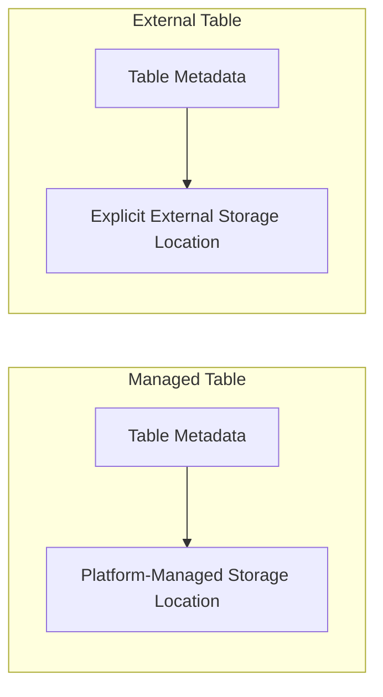

# 18 - Managed Table vs External Table

## Short answer

A managed table is a table where the platform manages both the metadata and the underlying storage location.

An external table is a table where the metadata is registered in the platform, but the storage location is explicitly managed outside the default managed-table path.

Both can be Delta tables.

That distinction is important.

The question is not only whether a table is Delta or not. The question is also who controls the storage location and lifecycle.

## Why this matters

People often confuse these ideas:

- table format, such as Delta
- table governance, such as Unity Catalog
- table storage ownership, such as managed vs external

Those are different concerns.

You can have:

- a managed Delta table
- an external Delta table

## Managed table

A managed table means Databricks manages:

- the table metadata
- the default storage location for the table data

In practical terms, when the table is dropped, the underlying data is usually dropped as part of that lifecycle as well, depending on the platform and governance setup.

Managed tables are useful when:

- the platform team wants simpler lifecycle management
- the data belongs fully inside the Databricks-managed environment
- you want fewer storage-location decisions at table-creation time

## External table

An external table means the metadata is registered in Databricks, but the data lives at a storage path that is explicitly defined.

That path is usually in cloud object storage managed more directly by the user or platform team.

External tables are useful when:

- the storage path must be controlled explicitly
- multiple tools or platforms need to reference the same storage location
- governance or storage boundaries require separate control of the data path
- the table should not rely on the default managed-table location

## Diagram



## Example mental model

### Managed table

You create the table and let the platform decide where the table data should live according to the configured managed storage pattern.

### External table

You create the table and explicitly point it to a storage path such as an external location or object storage path.

## Delta table vs managed table vs external table

These terms answer different questions.

| Question | Example answer |
| --- | --- |
| What format is the table? | Delta |
| Who governs the object? | Unity Catalog |
| Who controls the storage path lifecycle? | Managed or external |

So if someone asks, "Is this a Delta table?" they are asking about format.

If they ask, "Is this managed or external?" they are asking about storage ownership and lifecycle.

## Example SQL patterns

### Managed Delta table

```sql
CREATE TABLE main.demo.customer_spend (
  customer_id INT,
  spend DOUBLE
) USING DELTA;
```

### External Delta table

```sql
CREATE TABLE main.demo.customer_spend_external (
  customer_id INT,
  spend DOUBLE
) USING DELTA
LOCATION 's3://example-bucket/delta/customer_spend_external';
```

The exact external path and governance setup depend on your environment.

## When to choose managed tables

- simpler onboarding
- simpler lifecycle management
- fewer storage-path decisions
- good fit for many internal analytics tables

## When to choose external tables

- explicit storage control is required
- the storage path must exist outside the default managed location
- data sharing or lake-level storage design requires path-level control
- platform standards require external locations

## Common misunderstanding

People sometimes assume that:

- managed means Delta
- external means not Delta

That is not correct.

Managed vs external describes storage ownership and lifecycle.

Delta describes the table format.

## Practical rule

First ask whether the table should be Delta.

Then ask whether the storage path should be platform-managed or explicitly controlled.

## One-line summary

Managed vs external tells you who controls the table storage path and lifecycle, while Delta tells you the table format.