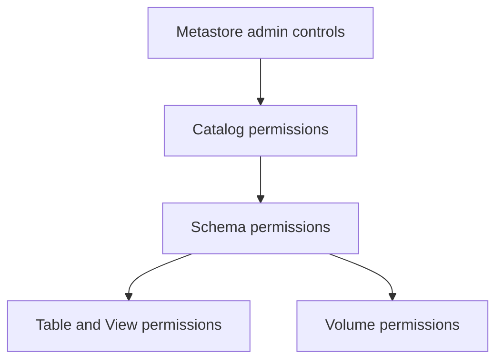

# 02 - Object Model and Permissions

## Permission inheritance model

A simplified mental model:

- grants at higher levels can affect lower levels
- object owners can manage permissions on their objects
- workspace access and data access are separate concerns

## High-level permission flow



## Common permissions by object type

Catalog-level examples:

- `USE CATALOG`
- `CREATE SCHEMA`

Schema-level examples:

- `USE SCHEMA`
- `CREATE TABLE`
- `CREATE VIEW`

Table-level examples:

- `SELECT`
- `MODIFY`
- `OWNERSHIP`

## Practical least-privilege pattern

For analyst groups:

- allow `USE CATALOG`
- allow `USE SCHEMA`
- allow `SELECT` on curated tables
- avoid `MODIFY` unless write access is needed

For engineer groups:

- allow create/modify on domain schemas
- grant broader permissions only in development layers
- isolate production write permissions to pipeline identities

## Example grants

```sql
GRANT USE CATALOG ON CATALOG finance TO `finance_analysts`;
GRANT USE SCHEMA ON SCHEMA finance.curated TO `finance_analysts`;
GRANT SELECT ON TABLE finance.curated.monthly_revenue TO `finance_analysts`;
```

## Frequent mistake

Having workspace access does not automatically give Unity Catalog data permissions.
