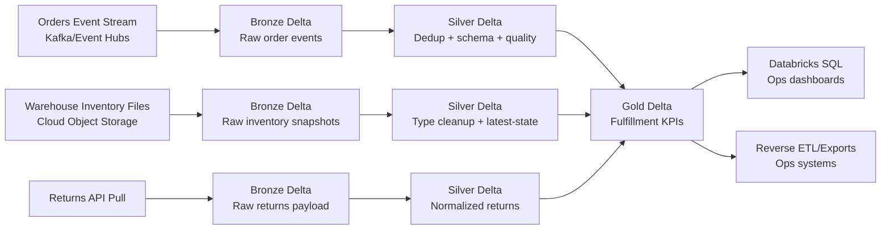

# Use Case: Retail Real-Time Order Fulfillment and Inventory Visibility

## Business problem

A large retailer needs near real-time visibility into:

- incoming customer orders from e-commerce and POS channels
- inventory availability by fulfillment center
- late shipment risk and stockout risk

Operations, support, and analytics teams depend on consistent KPIs every 5 minutes.

## Why Databricks is used here

Databricks helps because teams need one platform for:

- ingesting high-volume events and partner files
- transforming and validating data at scale
- orchestrating multi-step pipelines with retries and SLAs
- governing access with Unity Catalog
- serving curated outputs to BI and downstream systems

## End-to-end flow

## Industry practices applied

- Keep raw, replayable bronze data for audit and reprocessing.
- Add ingestion metadata (`ingest_ts`, source file/topic, batch ID).
- Use idempotent silver logic with deduplication keys.
- Quarantine invalid records instead of silently dropping them.
- Build gold tables around business entities and SLA windows.
- Use Unity Catalog permissions by domain (`raw`, `curated`, `serving`).
- Add observability on freshness, volume shifts, and quality failures.

## Databricks execution model

This use case uses a Databricks multi-task job:

1. `bronze_ingest` task lands source data into bronze Delta tables.
2. `silver_transform` task standardizes schemas and performs data quality checks.
3. `gold_publish` task builds KPI tables and writes destination extracts.

Task dependencies enforce proper sequencing while enabling retries from failed stages.

## Destination patterns

This use case writes to two destinations:

- primary destination: governed gold Delta tables for Databricks SQL dashboards
- secondary destination: partitioned parquet extracts for downstream operational tools

## Folder contents

- `databricks_job_spec.json`: sample Jobs API payload for orchestration
- `bronze_ingest_autoloader.py`: ingestion task template
- `silver_transform_dedup.py`: silver cleanup and dedup task template
- `gold_kpi_and_destination.py`: gold KPI creation and destination write template
- `scripts/pull_returns_api_to_landing.py`: source API extraction template for returns payloads
- `scripts/trigger_retail_ingestion_kafka.sh`: trigger Databricks pipeline with Kafka parameters
- `scripts/trigger_retail_ingestion_s3.sh`: trigger Databricks pipeline with S3 landing path parameters
- `scripts/trigger_retail_ingestion_local_minio.sh`: trigger Databricks pipeline using local MinIO source and destination paths
- `integrations/airflow_retail_ingestion_orchestration.py`: Airflow DAG integration template
- `local_podman/compose.yaml`: local Podman stack for MinIO source and destination buckets
- `local_podman/sample_data/`: sample source data for orders, inventory, and returns

## Example source loading flow

1. Run `scripts/pull_returns_api_to_landing.py` on a scheduler to collect paginated returns payloads.
2. Move generated files to your cloud landing path (for example `s3://my-company-landing/retail/returns/`).
3. Trigger Databricks ingestion using either the Kafka or S3 trigger script.
4. Let the Databricks job execute bronze, silver, and gold tasks.
5. Consume gold KPIs from Databricks SQL or exported parquet destinations.

## Local Podman source and destination setup

Use `local_podman/compose.yaml` to run MinIO locally with:

- `retail-source` bucket for ingestion inputs
- `retail-destination` bucket for gold output extracts
- `retail-checkpoints` bucket for streaming checkpoints

The `minio-init` service creates buckets and seeds sample data from `local_podman/sample_data/`.

## Notes before running

- Replace catalog/schema/table names with your environment values.
- Configure cloud paths and checkpoints for your storage account.
- Validate source contracts (JSON schema, CSV headers, API fields).
- Set appropriate cluster policy, autoscaling bounds, and retry settings.
